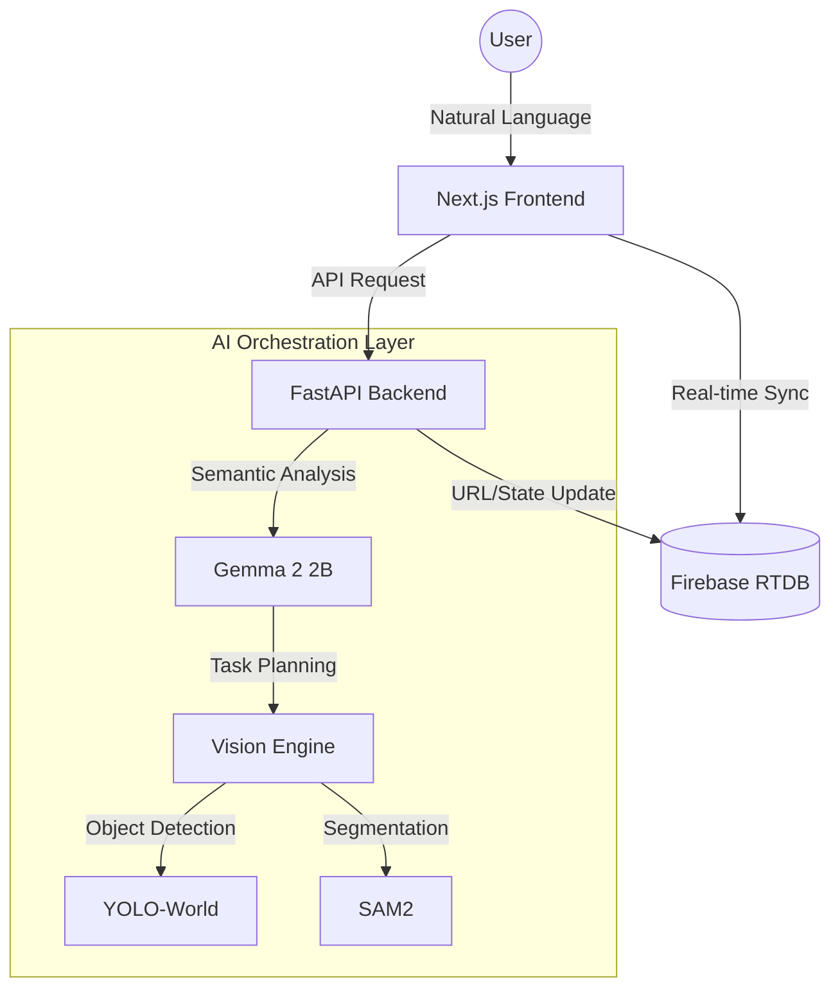

# 🚀 COEVIBED: AI-Powered Vision Agent Hub

> **"자연어로 제어하는 지능형 비전 에이전트 시스템"**
> 
> 단순한 이미지 크롭 도구를 넘어, Gemma LLM이 사용자의 의도를 분석하고 YOLO-World와 SAM2가 정밀하게 객체를 수확하는 통합 AI 에이전트 플랫폼입니다.

---

## 📺 Demo & Preview


---

## 🧠 프로젝트 철학: Brain & Worker 아키텍처
COEVIBED는 **'언어 모델(Brain)'**과 **'비전 모델(Worker)'**의 유기적인 결합을 목표로 설계되었습니다.

1. **Semantic Parsing (Gemma 2 2B):** 사용자의 모호한 자연어 명령(예: "하얀색 차량만 뽑아줘")을 분석하여 타겟 객체와 속성 필터를 생성합니다.
2. **Precision Harvesting (YOLO-World & SAM2):** 분석된 데이터를 바탕으로 비전 모델이 영상 내 객체를 탐지하고, 세그멘테이션을 통해 픽셀 단위로 정밀하게 크롭합니다.
3. **Hybrid Infrastructure:** 엄청난 컴퓨팅 파워를 요구하는 LLM과 비전 모델은 **로컬 GPU**에서, 사용자 인터페이스는 **Vercel**에서 동작하는 효율적인 하이브리드 구조를 가집니다.

---

## 🛠 Tech Stack

### Frontend
- **Framework:** Next.js 14 (App Router)
- **Styling:** Tailwind CSS
- **State/Sync:** Firebase Realtime Database
- **Deployment:** Vercel (Monorepo setup)

### Backend
- **Framework:** FastAPI (Python)
- **AI Models:** Gemma 2 2B, YOLO-World, SAM2 (Segment Anything Model 2)
- **Networking:** Cloudflare Tunnel

---

## 🏗 System Architecture



---

## ✨ Key Features

- **Natural Language Orchestration:** 복잡한 파라미터 설정 없이 일상적인 언어로 AI 태스크 수행
- **Semantic Filtering:** 색상, 공간적 위치 관계를 LLM이 이해하고 동적으로 필터링 적용
- **Real-time Monitoring:** Firebase를 통한 로컬-클라우드 간 상태 동기화 및 실시간 진행 상황 공유
- **Copilot-style UX:** 개발자 도구처럼 직관적이고 효율적인 결과물 교정 인터페이스 (Tab-to-fix)

---

## 📖 Technical Deep Dive: Why Refactoring?

기본적인 Rule-based 시스템에서 현재의 AI 에이전트 구조로 리팩토링하며 얻은 교훈들입니다.

- **데이터셋 구축의 효율화:** 단순 크롭이 아닌 의미 기반의 데이터 수집 프로세스 구축
- **컴퓨팅 자원 최적화:** 개인 단위 개발에서 LLM의 요구 사양을 해결하기 위한 하이브리드 아키텍처 도입
- **확장성:** 새로운 비전 모델이나 언어 모델로 언제든 교체 가능한 모듈형 워커 시스템 설계

---

## 🚀 Getting Started

### Prerequisites
- Python 3.10+
- Node.js 18+
- NVIDIA GPU (CUDA 11.8+ recommended for SAM2/Gemma)

### Installation
1. Clone the repository:
   ```bash
   git clone https://github.com/coevibed-a11y/coevibed.git
   ```
2. Setup Backend:
   ```bash
   cd backend
   pip install -r requirements.txt
   python run.py
   ```
3. Setup Frontend:
   ```bash
   cd frontend
   npm install
   npm run dev
   ```

---

## 📄 License
이 프로젝트는 **MIT License**를 따릅니다.

---
© 2026 [aboutKGT]. Built with passion and AI.